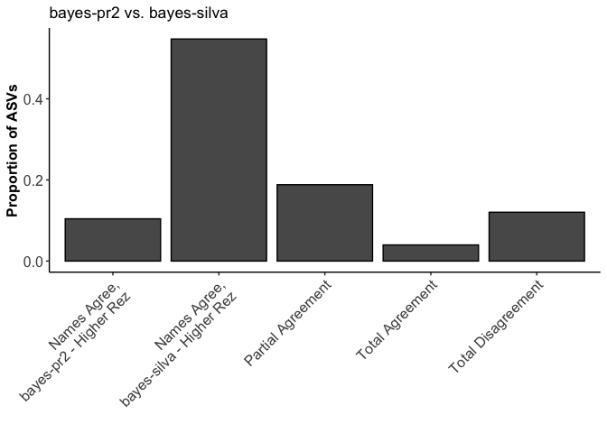
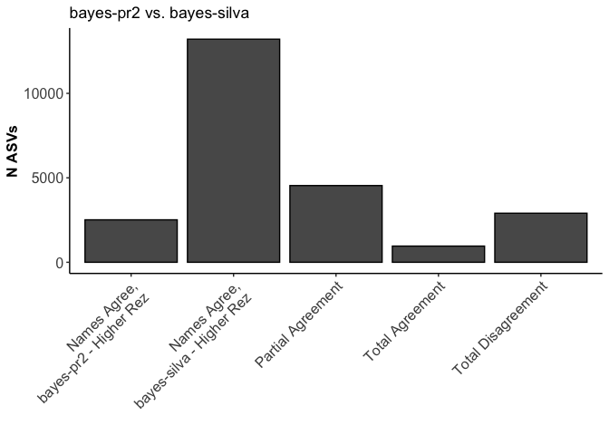
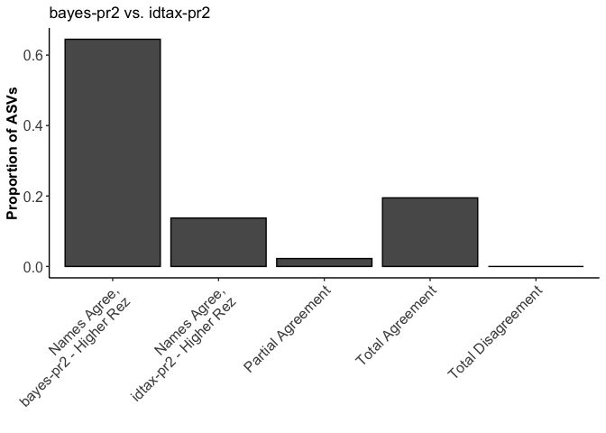
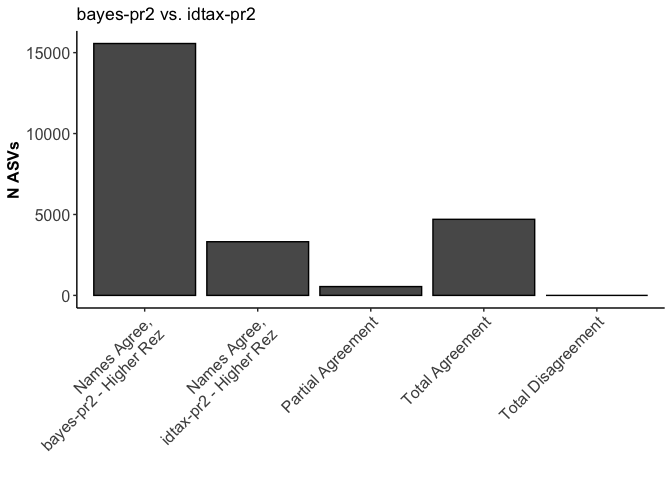

compare\_assignments\_2way Demo
================
D Catlett & C Liang
3/17/2020

Bugs seem fixed -- could still add numbers on top of bars to improve the plots, and needs a little more detailed QC

Overview
--------

Here we step through an example use of the compare\_assignments\_2way.R function. It provides a convenient 1-liner to compare and plot detailed comparisons of taxonomic annotations across two taxonomy tables. Requires that all taxonomy tables follow the same taxonomic naming and ranking conventions, that the order of columns in each taxonomy table follows the taxonomic ranking heirarchy (e.g., Kingdom = taxtable\[,1\], Species = taxtable\[,ncol(taxtable)\]), and that the order of rows (ASVs) in each of the input taxonomy tables is the same. Importantly, compare\_assignments\_2way also assumes that *unassigned* is indicated by *NA*, and requires the *ggplot2* package be installed prior to running.

### Start 'er up:

We'll clear out our environment, set our wd, and read in taxonomy tables: The taxonomy tables used here come from implementations of the RDP Bayesian classifier, the newer idtaxa algorithm, and MEGAN's LCA algorithm against both the Silva and pr2 reference databases. Our amplicon data set is an 18S-V9 tag sequencing project from the coastal ocean.

You can do this with any taxonomy tables assuming you format them properly. To follow along with this demo, grab the taxonomy tables in the "test\_data" directory of this repository and follow the code below.

``` r
rm(list = ls())

# setwd and read in your datasets:
setwd("~/Documents/R/desktop_ampData_processing/connie_taxonomy_stuff_Mar2020/18sV9_amplicon_sequencing/taxonomy_pipeline/demos_and_validation")

idtax.pr2 <- readRDS("~/Documents/R/amplicon_bioinformatics/taxonomy_pipeline/test_data/idtax_0boot_pr2_all18SAug19.rds")
bayes.pr2 <- readRDS("~/Documents/R/amplicon_bioinformatics/taxonomy_pipeline/test_data/bayes_0boot_pr2_all18SAug19.rds")
bayes.silva <- read.csv("~/Documents/R/amplicon_bioinformatics/taxonomy_pipeline/test_data/bayes_silva_60boot_mapped2pr2_all18SAug19.csv",
                        stringsAsFactors = FALSE)
idtax.silva <- read.csv("~/Documents/R/amplicon_bioinformatics/taxonomy_pipeline/test_data/idtax_silva_0boot_mapped2pr2_all18SAug19.csv",
                        stringsAsFactors = FALSE)
lca.pr2 <- read.csv("~/Documents/R/amplicon_bioinformatics/taxonomy_pipeline/test_data/LCA_pr2_mapped2pr2_all18SAug19.csv",
                        stringsAsFactors = FALSE)
lca.silva <- read.csv("~/Documents/R/amplicon_bioinformatics/taxonomy_pipeline/test_data/LCA_silva_mapped2pr2_all18SAug19_Fixed.csv",
                    stringsAsFactors = FALSE)
```

### Arranging and formatting our taxonomy tables:

The data we're using was pulled slightly haphazardly, so here we'll use some bootstrapping estimates to NA-out low-confidence assignments, reformat our taxonomy tables as dataframes, and sort them alphabetically by ASV sequences so that the order of rows/ASVs is the same across all taxonomy tables.

``` r
# convert tax tables to dataframes as needed and sort by seq's to get the same order..:
conf <- as.data.frame(bayes.pr2$boot, stringsAsFactors = FALSE)
bayes.pr2 <- as.data.frame(bayes.pr2$tax, stringsAsFactors = FALSE)
bayes.pr2[conf < 60] <- NA

source("~/Documents/R/amplicon_bioinformatics/taxonomy_pipeline/helper_fcns/idtax2df.R")
idtax.pr2 <- idtax2df(idtax.pr2, boot = 60)

# sorting each dataframe by DNA sequences:
ii <- sort(rownames(bayes.pr2), index.return = TRUE)
bayes.pr2 <- bayes.pr2[ii$ix,]
idtax.pr2 <- idtax.pr2[ii$ix,]
jj <- sort(bayes.silva$DNASeq, index.return = TRUE)
bayes.silva <- bayes.silva[jj$ix,2:9]
kk <- sort(idtax.silva$Sequence, index.return = TRUE)
idtax.silva <- idtax.silva[kk$ix,3:10]
ll <- sort(lca.silva$Sequence, index.return = TRUE)
lca.silva <- lca.silva[ll$ix,3:10]
mm <- sort(lca.pr2$Sequence, index.return = TRUE)
lca.pr2 <- lca.pr2[mm$ix,3:10]
```

You can run this for a sanity check:

``` r
# compare the sorted sequence arrays to ensure they're all =:
identical(ii$x, jj$x)
identical(jj$x, kk$x)
identical(kk$x, ll$x)
identical(ll$x,mm$x)
```

...and this to see what the data sets look like. These data sets are available in the test-data directory.

``` r
# one more check:
head(bayes.pr2, n = 10)
head(bayes.silva, n = 10)
head(idtax.pr2, n = 10)
head(idtax.silva, n = 10)
head(lca.pr2, n = 10)
head(lca.silva, n = 10)
```

Run compare\_assignments\_2way to compare assignment resolutions and identities across 2 of the above taxonomy tables:
----------------------------------------------------------------------------------------------------------------------

Here we'll do an example run and see what the inputs and outputs look like. The function counts the number of rows that (1) agree completely in identity and resolution; (2) disagree completely in that they have no non-NA names in common; (3, 4) agree completely where named, with table 1 (or 2) having higher resolution; or (5) agree where named to a particular rank, with 1 or more disagreements in non-NA names at subsequent ranks. The function will create two plots of the number and proportion of ASVs satisfying each of these conditions in your data set. We're setting *pltfilez = "none"* because we don't want to save our output plots as pdf files, but you can enter any 2 file names ending in *.pdf* to save the plots to your working directory if you prefer.

In this example, we'll compare bayes-pr2 and bayes-silva:

``` r
# make sure R can see the function:
source("~/Documents/R/amplicon_bioinformatics/taxonomy_pipeline/tax_table_comparisons/compare_assignments_2way.R")
# we'll compare these 2 to start:
tblnam <- c("bayes-pr2", "bayes-silva")
test1 <- compare_assignments_2way(bayes.pr2,bayes.silva, tablenames = tblnam, pltfilez = "none")
```

*test1* is a list containing our outputs, which include a dataframe of the row indices within each of the input taxonomy tables that satisfy each of the above 5 conditions described above, a second dataframe containing the data used for plotting, and two *ggplot2* objects that you can print and further customize to your liking. Let's look at the outputs, starting with the plots:

``` r
p.prop <- test1[[3]] # proportion plot
p.abs <- test1[[4]] # number of ASV plot

print(p.prop)
```



``` r
print(p.abs)
```



Here we see blah

Let's look at our indexing dataframe and sanity-check some of the comparisons:

``` r
indexDF <- test1[[1]]
head(indexDF,10) # look at the dataframe
```

    ##    Agree Disagree Agree.T1.more.rez T1.more.rez.t2rank Agree.T2.more.rez
    ## 1    135        5               127                  7                 1
    ## 2    238        7               645                  6                 2
    ## 3   1914        8              1936                  3                 3
    ## 4   1941        9              2535                  7                 4
    ## 5   2742       10              2747                  5                11
    ## 6   2753       12              2755                  5                15
    ## 7   2767       13              2756                  5                16
    ## 8   2769       14              2768                  6                17
    ## 9   2771       19              2770                  6                18
    ## 10  2804       20              2775                  6                21
    ##    T2.more.rez.t1rank pAgree.i pAgree.rank
    ## 1                   1        6           1
    ## 2                   1       25           1
    ## 3                   1       26           1
    ## 4                   1       27           1
    ## 5                   3       28           2
    ## 6                   1       37           1
    ## 7                   1       47           1
    ## 8                   1       59           1
    ## 9                   1       60           1
    ## 10                  1       68           1

``` r
# de-cluttering rownames:
rownames(bayes.pr2) <- NULL

# Look at 5 entries flagged as "disagreeing":
ii <- indexDF$Disagree[1:5]
bayes.pr2[ii,]
```

    ##      Kingdom   Supergroup Division Class Order Family Genus Species
    ## 5  Eukaryota Opisthokonta     <NA>  <NA>  <NA>   <NA>  <NA>    <NA>
    ## 7  Eukaryota Opisthokonta     <NA>  <NA>  <NA>   <NA>  <NA>    <NA>
    ## 8  Eukaryota         <NA>     <NA>  <NA>  <NA>   <NA>  <NA>    <NA>
    ## 9  Eukaryota Opisthokonta     <NA>  <NA>  <NA>   <NA>  <NA>    <NA>
    ## 10 Eukaryota Opisthokonta     <NA>  <NA>  <NA>   <NA>  <NA>    <NA>

``` r
bayes.silva[ii,]
```

    ##         pr2_r1 pr2_r2 pr2_r3 pr2_r4 pr2_r5 pr2_r6 pr2_r7 pr2_r8
    ## 23426 Bacteria   <NA>   <NA>   <NA>   <NA>   <NA>   <NA>     NA
    ## 23432 Bacteria   <NA>   <NA>   <NA>   <NA>   <NA>   <NA>     NA
    ## 23422 Bacteria   <NA>   <NA>   <NA>   <NA>   <NA>   <NA>     NA
    ## 23433 Bacteria   <NA>   <NA>   <NA>   <NA>   <NA>   <NA>     NA
    ## 23429 Bacteria   <NA>   <NA>   <NA>   <NA>   <NA>   <NA>     NA

``` r
# Look at 10 entries flagged as "partial agreements":
ii <- indexDF$pAgree.i[1:10]
bayes.pr2[ii,]
```

    ##      Kingdom   Supergroup Division Class Order Family Genus Species
    ## 6  Eukaryota Opisthokonta     <NA>  <NA>  <NA>   <NA>  <NA>    <NA>
    ## 25 Eukaryota Opisthokonta     <NA>  <NA>  <NA>   <NA>  <NA>    <NA>
    ## 26 Eukaryota Opisthokonta     <NA>  <NA>  <NA>   <NA>  <NA>    <NA>
    ## 27 Eukaryota Opisthokonta     <NA>  <NA>  <NA>   <NA>  <NA>    <NA>
    ## 28 Eukaryota Opisthokonta  Metazoa  <NA>  <NA>   <NA>  <NA>    <NA>
    ## 37 Eukaryota Opisthokonta     <NA>  <NA>  <NA>   <NA>  <NA>    <NA>
    ## 47 Eukaryota Opisthokonta     <NA>  <NA>  <NA>   <NA>  <NA>    <NA>
    ## 59 Eukaryota Opisthokonta     <NA>  <NA>  <NA>   <NA>  <NA>    <NA>
    ## 60 Eukaryota Opisthokonta     <NA>  <NA>  <NA>   <NA>  <NA>    <NA>
    ## 68 Eukaryota Opisthokonta     <NA>  <NA>  <NA>   <NA>  <NA>    <NA>

``` r
bayes.silva[ii,]
```

    ##          pr2_r1         pr2_r2          pr2_r3           pr2_r4
    ## 22931 Eukaryota Archaeplastida     Chlorophyta Trebouxiophyceae
    ## 5681  Eukaryota  Stramenopiles      Ochrophyta  Bacillariophyta
    ## 18347 Eukaryota  Stramenopiles Stramenopiles_X        Opalinata
    ## 5045  Eukaryota       Excavata         Discoba    Heterolobosea
    ## 10693 Eukaryota   Opisthokonta           Fungi     Mucoromycota
    ## 16458 Eukaryota       Excavata      Metamonada      Parabasalia
    ## 13913 Eukaryota      Alveolata  Dinoflagellata      Dinophyceae
    ## 19647 Eukaryota       Excavata      Metamonada      Parabasalia
    ## 5057  Eukaryota       Excavata         Discoba    Heterolobosea
    ## 20283 Eukaryota Archaeplastida      Rhodophyta  Florideophyceae
    ##                   pr2_r5                       pr2_r6            pr2_r7 pr2_r8
    ## 22931 Trebouxiophyceae_X          Trebouxiophyceae_XX     Microthamnion     NA
    ## 5681   Bacillariophyta_X   Polar-centric-Mediophyceae          Eucampia     NA
    ## 18347               <NA>                         <NA>              <NA>     NA
    ## 5045     Heterolobosea_X               Vahlkampfiidae         Naegleria     NA
    ## 10693     Mucoromycotina             Mucoromycotina_X           Absidia     NA
    ## 16458     Cristamonadida Calonymphidae-Devescovinidae Deltotrichonympha     NA
    ## 13913      Dinophyceae_X               Dinophyceae_XX         Abedinium     NA
    ## 19647     Cristamonadida Calonymphidae-Devescovinidae      Gigantomonas     NA
    ## 5057     Heterolobosea_X               Vahlkampfiidae         Naegleria     NA
    ## 20283       Halymeniales               Halymeniales_X        Isabbottia     NA

WE see something

Let's do another example:

``` r
# we'll compare these 2 to start:
tblnam <- c("bayes-pr2", "idtax-pr2")
test2 <- compare_assignments_2way(bayes.pr2,idtax.pr2, tablenames = tblnam, pltfilez = "none")

# plot it up:
p.prop <- test2[[3]] # proportion plot
p.abs <- test2[[4]] # number of ASV plot

print(p.prop)
```



``` r
print(p.abs)
```



``` r
indexDF <- test2[[1]]
head(indexDF,10) # look at the dataframe
```

    ##    Agree Disagree Agree.T1.more.rez T1.more.rez.t2rank Agree.T2.more.rez
    ## 1    128       NA                 1                  0              2418
    ## 2    237       NA                 2                  0              2536
    ## 3    238       NA                 3                  0              2751
    ## 4    257       NA                 4                  0              2765
    ## 5    508       NA                 5                  0              2769
    ## 6    509       NA                 6                  0              2787
    ## 7    528       NA                 7                  0              2795
    ## 8   1938       NA                 8                  0              2800
    ## 9   1942       NA                 9                  0              2804
    ## 10  2285       NA                10                  0              2860
    ##    T2.more.rez.t1rank pAgree.i pAgree.rank
    ## 1                   1     2746           2
    ## 2                   2     2761           1
    ## 3                   2     2775           5
    ## 4                   1     2797           6
    ## 5                   6     2857           6
    ## 6                   1     2867           3
    ## 7                   1     3088           1
    ## 8                   6     3371           2
    ## 9                   1     3395           6
    ## 10                  3     3407           3

``` r
# Look at 5 entries flagged as "agreeing":
ii <- indexDF$Agree[1:5]
bayes.pr2[ii,]
```

    ##       Kingdom    Supergroup        Division          Class            Order
    ## 128 Eukaryota          <NA>            <NA>           <NA>             <NA>
    ## 237 Eukaryota Stramenopiles Stramenopiles_X           MAST          MAST-12
    ## 238 Eukaryota Stramenopiles Stramenopiles_X Pirsonia_Clade Pirsonia_Clade_X
    ## 257 Eukaryota          <NA>            <NA>           <NA>             <NA>
    ## 508 Eukaryota          <NA>            <NA>           <NA>             <NA>
    ##                Family      Genus        Species
    ## 128              <NA>       <NA>           <NA>
    ## 237          MAST-12D MAST-12D_X MAST-12D_X_sp.
    ## 238 Pirsonia_Clade_XX   Pirsonia           <NA>
    ## 257              <NA>       <NA>           <NA>
    ## 508              <NA>       <NA>           <NA>

``` r
idtax.pr2[ii,]
```

    ##              X2            X3              X4             X5               X6
    ## 19978 Eukaryota          <NA>            <NA>           <NA>             <NA>
    ## 21051 Eukaryota Stramenopiles Stramenopiles_X           MAST          MAST-12
    ## 22756 Eukaryota Stramenopiles Stramenopiles_X Pirsonia_Clade Pirsonia_Clade_X
    ## 23532 Eukaryota          <NA>            <NA>           <NA>             <NA>
    ## 19520 Eukaryota          <NA>            <NA>           <NA>             <NA>
    ##                      X7         X8             X9
    ## 19978              <NA>       <NA>           <NA>
    ## 21051          MAST-12D MAST-12D_X MAST-12D_X_sp.
    ## 22756 Pirsonia_Clade_XX   Pirsonia           <NA>
    ## 23532              <NA>       <NA>           <NA>
    ## 19520              <NA>       <NA>           <NA>

``` r
# Look at 10 entries flagged as "partial agreements":
ii <- indexDF$pAgree.i[1:5]
bayes.pr2[ii,]
```

    ##        Kingdom     Supergroup    Division               Class           Order
    ## 2746 Eukaryota   Opisthokonta     Metazoa                <NA>            <NA>
    ## 2761 Eukaryota   Opisthokonta     Metazoa                <NA>            <NA>
    ## 2775 Eukaryota   Opisthokonta       Fungi          Ascomycota  Pezizomycotina
    ## 2797 Eukaryota       Hacrobia     Picozoa           Picozoa_X      Picozoa_XX
    ## 2857 Eukaryota Archaeplastida Chlorophyta Chlorodendrophyceae Chlorodendrales
    ##                Family       Genus               Species
    ## 2746             <NA>        <NA>                  <NA>
    ## 2761             <NA>        <NA>                  <NA>
    ## 2775   Eurotiomycetes  Rasamsonia Rasamsonia_argillacea
    ## 2797      Picozoa_XXX   Picomonas  Picomonas_judraskeda
    ## 2857 Chlorodendraceae Tetraselmis                  <NA>

``` r
idtax.pr2[ii,]
```

    ##              X2             X3          X4                  X5
    ## 18047 Eukaryota   Opisthokonta       Fungi     Chytridiomycota
    ## 21154 Eukaryota       Rhizaria    Cercozoa   Filosa-Imbricatea
    ## 10221 Eukaryota   Opisthokonta       Fungi          Ascomycota
    ## 11206 Eukaryota       Hacrobia     Picozoa           Picozoa_X
    ## 17371 Eukaryota Archaeplastida Chlorophyta Chlorodendrophyceae
    ##                        X6               X7                 X8
    ## 18047   Chytridiomycotina Chytridiomycetes Chytridiomycetes_X
    ## 21154 Filosa-Imbricatea_X    Novel-clade-2    Novel-clade-2_X
    ## 10221      Pezizomycotina  Dothideomycetes               <NA>
    ## 11206          Picozoa_XX      Picozoa_XXX       Picozoa_XXXX
    ## 17371     Chlorodendrales Chlorodendraceae Chlorodendrales_XX
    ##                           X9
    ## 18047 Chytridiomycetes_X_sp.
    ## 21154    Novel-clade-2_X_sp.
    ## 10221                   <NA>
    ## 11206       Picozoa_XXXX_sp.
    ## 17371 Chlorodendrales_XX_sp.
