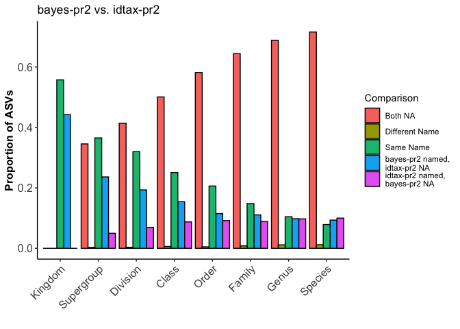
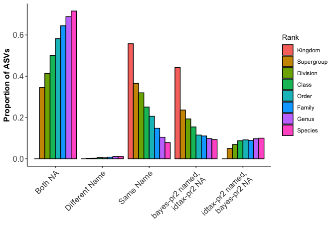

compare\_byRank\_2way Demo.Rmd
================
D Catlett
3/25/2020

Overview
--------

Here we step through an example use of the compare\_byRank\_2way function. It provides a convenient 1-liner to compare and plot results of detailed, rank-wise comparisons of taxonomic annotations across two taxonomy tables. Requires that all taxonomy tables follow the same taxonomic naming and ranking conventions, that the order of columns in each taxonomy table follows the taxonomic ranking heirarchy (e.g., Kingdom = taxtable\[,1\], Species = taxtable\[,ncol(taxtable)\]), and that the order of rows (ASVs) in each of the input taxonomy tables is the same. Importantly, compare\_assignments\_2way also assumes that *unassigned* is indicated by *NA*, and requires the *ggplot2* package be installed prior to running.

### Start 'er up:

We'll clear out our environment, set our wd, and read in taxonomy tables: The taxonomy tables used here come from implementations of the RDP Bayesian classifier, the newer idtaxa algorithm, and MEGAN's LCA algorithm against both the Silva and pr2 reference databases. Our amplicon data set is an 18S-V9 tag sequencing project from the coastal ocean.

You can do this with any taxonomy tables assuming you format them properly. To follow along with this demo, grab the taxonomy tables in the "test\_data" directory of this repository and follow the code below.

``` r
rm(list = ls())

# setwd and read in your datasets:
setwd("~/Documents/R/amplicon_bioinformatics/taxonomy_pipeline/demos_and_validation")

idtax.pr2 <- readRDS("~/Documents/R/amplicon_bioinformatics/taxonomy_pipeline/test_data/idtax_0boot_pr2_all18SAug19.rds")
bayes.pr2 <- readRDS("~/Documents/R/amplicon_bioinformatics/taxonomy_pipeline/test_data/bayes_0boot_pr2_all18SAug19.rds")
bayes.silva <- read.csv("~/Documents/R/amplicon_bioinformatics/taxonomy_pipeline/test_data/bayes_silva_60boot_mapped2pr2_all18SAug19.csv",
                        stringsAsFactors = FALSE)
idtax.silva <- read.csv("~/Documents/R/amplicon_bioinformatics/taxonomy_pipeline/test_data/idtax_silva_0boot_mapped2pr2_all18SAug19.csv",
                        stringsAsFactors = FALSE)
lca.pr2 <- read.csv("~/Documents/R/amplicon_bioinformatics/taxonomy_pipeline/test_data/LCA_pr2_mapped2pr2_all18SAug19.csv",
                        stringsAsFactors = FALSE)
lca.silva <- read.csv("~/Documents/R/amplicon_bioinformatics/taxonomy_pipeline/test_data/LCA_silva_mapped2pr2_all18SAug19_Fixed.csv",
                    stringsAsFactors = FALSE)
```

### Arranging and formatting our taxonomy tables:

The data we're using was pulled slightly haphazardly, so here we'll use some bootstrapping estimates to NA-out low-confidence assignments, reformat our taxonomy tables as dataframes, and sort them alphabetically by ASV sequences so that the order of rows/ASVs is the same across all taxonomy tables.

``` r
# convert tax tables to dataframes as needed and sort by seq's to get the same order..:
conf <- as.data.frame(bayes.pr2$boot, stringsAsFactors = FALSE)
bayes.pr2 <- as.data.frame(bayes.pr2$tax, stringsAsFactors = FALSE)
bayes.pr2[conf < 60] <- NA

source("~/Documents/R/amplicon_bioinformatics/taxonomy_pipeline/helper_fcns/idtax2df.R")
idtax.pr2 <- idtax2df(idtax.pr2, boot = 60)

# sorting each dataframe by DNA sequences:
ii <- sort(rownames(bayes.pr2), index.return = TRUE)
bayes.pr2 <- bayes.pr2[ii$ix,]
idtax.pr2 <- idtax.pr2[ii$ix,]
jj <- sort(bayes.silva$DNASeq, index.return = TRUE)
bayes.silva <- bayes.silva[jj$ix,2:9]
kk <- sort(idtax.silva$Sequence, index.return = TRUE)
idtax.silva <- idtax.silva[kk$ix,3:10]
ll <- sort(lca.silva$Sequence, index.return = TRUE)
lca.silva <- lca.silva[ll$ix,3:10]
mm <- sort(lca.pr2$Sequence, index.return = TRUE)
lca.pr2 <- lca.pr2[mm$ix,3:10]
```

You can run this for a sanity check:

``` r
# compare the sorted sequence arrays to ensure they're all =:
identical(ii$x, jj$x)
identical(jj$x, kk$x)
identical(kk$x, ll$x)
identical(ll$x,mm$x)
```

...and this to see what the data sets look like. These data sets are available in the test-data directory.

``` r
# one more check:
head(bayes.pr2, n = 10)
head(bayes.silva, n = 10)
head(idtax.pr2, n = 10)
head(idtax.silva, n = 10)
head(lca.pr2, n = 10)
head(lca.silva, n = 10)
```

### First run

Here we'll run the function and print out the 2 pre-made plots:

``` r
# make sure R can see the function:
source("~/Documents/R/amplicon_bioinformatics/taxonomy_pipeline/tax_table_comparisons/compare_byRank_2way.R")
# we'll compare these 2 to start:
tblnam <- c("bayes-pr2", "idtax-pr2")
test1 <- compare_byRank_2way(bayes.pr2, idtax.pr2, tablenames = tblnam, pltfilez = "none")
p1 <- test1[[3]]
print(p1)
```



``` r
p2 <- test1[[4]]
print(p2)
```



The two plots are showing the same data, we've just switched the x-axis and the color-axis between the 2. Either way, our test comparison looks pretty nice -- most of the discrepancies between these two taxonomy tables are due to variable assignment resolutions rather than disagreeing taxon name assignments.

Moving on... *test1* is a list with all the outputs. You can see above that the plots are stored the 3rd and 4th element of the output list. What's in positions 1 and 2?

Position 2 is simply the dataframe that was used to generate the plots. You can use it to re-create the plots or customize your own. You can see what it looks like by doing:

``` r
plotDF <- test1[[2]]
head(plotDF)
```

    ##                      comp     count       rank
    ## both.na           both.na 0.0000000    Kingdom
    ## t1named.t2NA t1named.t2NA 0.4423858    Kingdom
    ## t2named.t1NA t2named.t1NA 0.0000000    Kingdom
    ## same.name       same.name 0.5576142    Kingdom
    ## diff.name       diff.name 0.0000000    Kingdom
    ## both.na1          both.na 0.3455608 Supergroup

*test1\[\[1\]\]* is a list (a list within a list?!) that contains 8 dataframes (one for each rank of our taxonomy tables, in order of the taxonomic heirarchy), that has the row indices of each of the comparsion categories. Let's take a look and QC some of our comparisons:

``` r
indexlister <- test1[[1]]
kingdom.idx <- indexlister[[1]]
head(kingdom.idx)
```

    ##   both.na t1named.t2NA t2named.t1NA same.name diff.name
    ## 1      NA            1           NA       127        NA
    ## 2      NA            2           NA       128        NA
    ## 3      NA            3           NA       237        NA
    ## 4      NA            4           NA       238        NA
    ## 5      NA            5           NA       257        NA
    ## 6      NA            6           NA       508        NA

You can see the column names of this dataframe describes the comparison, and each column contains either numbers or NA's. NA's are used here to keep the structure of this index array homogenous - columns with all NA's indicate there were no instances where this comparison criteria was observed. Here we this is the case for the columns *both.na*, *t2named.t1NA*, *diff.name*. This means that at the Kingdom rank, 0 of our ASVs were unassigned in both taxonomy tables (*both.na*), 0 ASVs included an assignment in *idtax-pr2* but not in *bayes-pr2* (*t2named.t1NA*), and 0 of our ASVs had disagreeing Kingdom assignments across the two tables (*diff.name*).

We do see that there are ASVs where *bayes-pr2* was assigned at Kingdom while *idtax-pr2* was not, and where each of these tables were assigned to the same Kingdom (*same.name*). We can check each of these by doing (for both assigned):

``` r
bayes.pr2[kingdom.idx$same.name[1:5],1]
```

    ## [1] "Eukaryota" "Eukaryota" "Eukaryota" "Eukaryota" "Eukaryota"

``` r
idtax.pr2[kingdom.idx$same.name[1:5],1]
```

    ## [1] "Eukaryota" "Eukaryota" "Eukaryota" "Eukaryota" "Eukaryota"

or for ASVs where *bayes-pr2* was assigned at Kingdom while *idtax-pr2* was not:

``` r
bayes.pr2[kingdom.idx$t1named.t2NA[1:5],1]
```

    ## [1] "Eukaryota" "Eukaryota" "Eukaryota" "Eukaryota" "Eukaryota"

``` r
idtax.pr2[kingdom.idx$t1named.t2NA[1:5],1]
```

    ## [1] NA NA NA NA NA

These turn out as we expected them! Noice! Note that these observations are expected due to the bayesian-classifier's propensity to over-assign depending on the coverage of the reference database. We know that our primers are not euk-specific, but we also know that the PR2 database only includes euk's, so by definition all of our ASVs will be assigned to Eukaryota by the bayesian classifier when implementing against PR2. So these results make sense, which is siiiiiiooooockkkk!

We can look at other ranks too. Let's try 'species' (rank 8 in pr2):

``` r
indexlister <- test1[[1]]
sp.idx <- indexlister[[8]]
head(sp.idx)
```

    ##   both.na t1named.t2NA t2named.t1NA same.name diff.name
    ## 1       1          127         2418       237      2797
    ## 2       2         1936         2536      2755      3371
    ## 3       3         1937         2746      2756      3395
    ## 4       4         2535         2751      2757      3411
    ## 5       5         2747         2761      2781      3431
    ## 6       6         2768         2765      2789      3434

``` r
bayes.pr2[sp.idx$same.name[1:5],8]
```

    ## [1] "MAST-12D_X_sp."               "Stephanoecidae_Group_E_X_sp."
    ## [3] "Stephanoecidae_Group_E_X_sp." "Ventrifissuridae_X_sp."      
    ## [5] "Mataza-lineage_X_sp."

``` r
idtax.pr2[sp.idx$same.name[1:5],8]
```

    ## [1] "MAST-12D_X_sp."               "Stephanoecidae_Group_E_X_sp."
    ## [3] "Stephanoecidae_Group_E_X_sp." "Ventrifissuridae_X_sp."      
    ## [5] "Mataza-lineage_X_sp."

``` r
bayes.pr2[sp.idx$diff.name[1:5],8]
```

    ## [1] "Picomonas_judraskeda" "MAST-9D_X_sp."        "Pedinella_sp."       
    ## [4] "Pedinella_sp."        "Pteridomonas_danica"

``` r
idtax.pr2[sp.idx$diff.name[1:5],8]
```

    ## [1] "Picozoa_XXXX_sp."            "Chrysophyceae_Clade-H_X_sp."
    ## [3] "Pedinellales_X_sp."          "Pedinellales_X_sp."         
    ## [5] "Pedinellales_X_sp."

``` r
bayes.pr2[sp.idx$both.na[1:5],8]
```

    ## [1] NA NA NA NA NA

``` r
idtax.pr2[sp.idx$both.na[1:5],8]
```

    ## [1] NA NA NA NA NA

At the species rank, we see that there are some ASVs that satisfy all 5 possible comparison outcomes. That makes sense as we expect both more error and more variance in species assignments. When we check the first 5 indices of some of these groupings, we see that the comparisons are valid. yay :)
