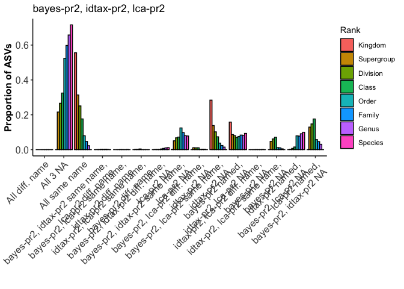

compare\_byRank\_3way Demo.Rmd
================
D Catlett
3/25/2020

Still working on this one....

Overview
--------

Here we step through an example use of the compare\_byRank\_3way function. It provides a convenient 1-liner to compare and plot results of detailed, rank-wise comparisons of taxonomic annotations across three taxonomy tables. Requires that all taxonomy tables follow the same taxonomic naming and ranking conventions, that the order of columns in each taxonomy table follows the taxonomic ranking heirarchy (e.g., Kingdom = taxtable\[,1\], Species = taxtable\[,ncol(taxtable)\]), and that the order of rows (ASVs) in each of the input taxonomy tables is the same. Importantly, compare\_byRank\_3way also assumes that *unassigned* is indicated by *NA*, and requires the *ggplot2* package be installed prior to running.

### Start 'er up:

We'll clear out our environment, set our wd, and read in taxonomy tables: The taxonomy tables used here come from implementations of the RDP Bayesian classifier, the newer idtaxa algorithm, and MEGAN's LCA algorithm against both the Silva and pr2 reference databases. Our amplicon data set is an 18S-V9 tag sequencing project from the coastal ocean.

You can do this with any taxonomy tables assuming you format them properly. To follow along with this demo, grab the taxonomy tables in the "test\_data" directory of this repository and follow the code below.

``` r
rm(list = ls())

# setwd and read in your datasets:
setwd("~/Documents/R/amplicon_bioinformatics/taxonomy_pipeline/demos_and_validation")

idtax.pr2 <- readRDS("~/Documents/R/amplicon_bioinformatics/taxonomy_pipeline/test_data/idtax_0boot_pr2_all18SAug19.rds")
bayes.pr2 <- readRDS("~/Documents/R/amplicon_bioinformatics/taxonomy_pipeline/test_data/bayes_0boot_pr2_all18SAug19.rds")
bayes.silva <- read.csv("~/Documents/R/amplicon_bioinformatics/taxonomy_pipeline/test_data/bayes_silva_60boot_mapped2pr2_all18SAug19.csv",
                        stringsAsFactors = FALSE)
idtax.silva <- read.csv("~/Documents/R/amplicon_bioinformatics/taxonomy_pipeline/test_data/idtax_silva_0boot_mapped2pr2_all18SAug19.csv",
                        stringsAsFactors = FALSE)
lca.pr2 <- read.csv("~/Documents/R/amplicon_bioinformatics/taxonomy_pipeline/test_data/LCA_pr2_mapped2pr2_all18SAug19.csv",
                        stringsAsFactors = FALSE)
lca.silva <- read.csv("~/Documents/R/amplicon_bioinformatics/taxonomy_pipeline/test_data/LCA_silva_mapped2pr2_all18SAug19_Fixed.csv",
                    stringsAsFactors = FALSE)
```

### Arranging and formatting our taxonomy tables:

The data we're using was pulled slightly haphazardly, so here we'll use some bootstrapping estimates to NA-out low-confidence assignments, reformat our taxonomy tables as dataframes, and sort them alphabetically by ASV sequences so that the order of rows/ASVs is the same across all taxonomy tables.

``` r
# convert tax tables to dataframes as needed and sort by seq's to get the same order..:
conf <- as.data.frame(bayes.pr2$boot, stringsAsFactors = FALSE)
bayes.pr2 <- as.data.frame(bayes.pr2$tax, stringsAsFactors = FALSE)
bayes.pr2[conf < 60] <- NA

source("~/Documents/R/amplicon_bioinformatics/taxonomy_pipeline/helper_fcns/idtax2df.R")
idtax.pr2 <- idtax2df(idtax.pr2, boot = 60)

# sorting each dataframe by DNA sequences:
ii <- sort(rownames(bayes.pr2), index.return = TRUE)
bayes.pr2 <- bayes.pr2[ii$ix,]
idtax.pr2 <- idtax.pr2[ii$ix,]
jj <- sort(bayes.silva$DNASeq, index.return = TRUE)
bayes.silva <- bayes.silva[jj$ix,2:9]
kk <- sort(idtax.silva$Sequence, index.return = TRUE)
idtax.silva <- idtax.silva[kk$ix,3:10]
ll <- sort(lca.silva$Sequence, index.return = TRUE)
lca.silva <- lca.silva[ll$ix,3:10]
mm <- sort(lca.pr2$Sequence, index.return = TRUE)
lca.pr2 <- lca.pr2[mm$ix,3:10]
```

You can run this for a sanity check:

``` r
# compare the sorted sequence arrays to ensure they're all =:
identical(ii$x, jj$x)
identical(jj$x, kk$x)
identical(kk$x, ll$x)
identical(ll$x,mm$x)
```

...and this to see what the data sets look like. These data sets are available in the test-data directory.

``` r
# one more check:
head(bayes.pr2, n = 10)
head(bayes.silva, n = 10)
head(idtax.pr2, n = 10)
head(idtax.silva, n = 10)
head(lca.pr2, n = 10)
head(lca.silva, n = 10)
```

### First run

Here we'll run the function and print out the 2 pre-made plots:

``` r
# make sure R can see the function:
source("~/Documents/R/amplicon_bioinformatics/taxonomy_pipeline/tax_table_comparisons/compare_byRank_3way.R")
# we'll compare these 2 to start:
tblnam <- c("bayes-pr2", "idtax-pr2","lca-pr2")
test1 <- compare_byRank_3way(bayes.pr2, idtax.pr2, lca.pr2, tablenames = tblnam, pltfilez = "none")
p1 <- test1[[4]]
print(p1)
```


``` r
p2 <- test1[[5]]
print(p2)
```



The two plots show essentially the same suite of comparisons, but with varying specificity. The first plot is more broad, with more general comparisons. We see that in general, the 3 taxonomy tables we chose agreed where they were named at most ranks, with discrepancies explained largely by variable taxonomic resolution rather than varying taxon names across the tables.

The second plot (sorry for the cluttering) breaks down the results shown in the first plot with more specificity - for example, rather than looking at the proportion of classifications where 1 table was named and the other two were unassigned with no specifics about which table included the name, we break this classification down into things like *bayes-pr2 was named while the other 2 were not*.

We can also look at the dataframes used in creating these 2 plots, in case you want to customize the ggplots shown above:

``` r
plotDF1 <- test1[[2]]
head(plotDF1)
```

    ##                                  comp       count    rank
    ## all.na                         all.na 0.000000000 Kingdom
    ## t1named.t23NA           t1named.t23NA 0.158169610 Kingdom
    ## t2named.t13NA           t2named.t13NA 0.000000000 Kingdom
    ## t3named.t12NA           t3named.t12NA 0.000000000 Kingdom
    ## t12named.same.t3NA t12named.same.t3NA 0.001533615 Kingdom
    ## t12named.diff.t3NA t12named.diff.t3NA 0.000000000 Kingdom

``` r
plotDF2 <- test1[[3]]
head(plotDF2)
```

    ##      comp     count       rank
    ## 1  all.na 0.0000000    Kingdom
    ## 8  all.na 0.2159496 Supergroup
    ## 15 all.na 0.2664346   Division
    ## 22 all.na 0.3249606      Class
    ## 29 all.na 0.5243720      Order
    ## 36 all.na 0.5980270     Family

And finally, we can pull the indices corresponding to each of our comparison metrics (in the 2nd plot only, since those in the 1st can be computed by summing components shown in the 2nd plot):

``` r
indexlister <- test1[[1]]
kingdom.idx <- indexlister[[1]]
head(kingdom.idx)
```

    ##   all.na t1named.t23NA t2named.t13NA t3named.t12NA t12named.same.t3NA
    ## 1     NA             1            NA            NA                128
    ## 2     NA             2            NA            NA                257
    ## 3     NA             3            NA            NA                508
    ## 4     NA             4            NA            NA                509
    ## 5     NA             5            NA            NA                528
    ## 6     NA             6            NA            NA               1938
    ##   t12named.diff.t3NA t13named.same.t2NA t13named.diff.t2NA t23named.same.t1NA
    ## 1                 NA                135                 NA                 NA
    ## 2                 NA                636                 NA                 NA
    ## 3                 NA                637                 NA                 NA
    ## 4                 NA                638                 NA                 NA
    ## 5                 NA                645                 NA                 NA
    ## 6                 NA                646                 NA                 NA
    ##   t23named.diff.t1NA allN.t12same.t3diff allN.t13same.t2diff
    ## 1                 NA                  NA                  NA
    ## 2                 NA                  NA                  NA
    ## 3                 NA                  NA                  NA
    ## 4                 NA                  NA                  NA
    ## 5                 NA                  NA                  NA
    ## 6                 NA                  NA                  NA
    ##   allN.t23same.t1diff all.same.name all.diff.name
    ## 1                  NA           127            NA
    ## 2                  NA           237            NA
    ## 3                  NA           238            NA
    ## 4                  NA          1931            NA
    ## 5                  NA          1936            NA
    ## 6                  NA          1937            NA

There are obviously a lot of different comparison outcomes, but we can look at a few:
