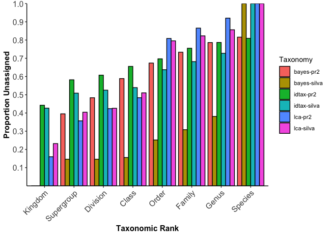

compare\_taxrez Demo
================
D Catlett & C Liang
3/14/2020

Overview
--------

Here we step through an example use of the compare\_taxrez.R function. It provides a convenient 1-liner to compare and plot the resolutions of taxonomic annotations across multiple taxonomy tables. Requires that all taxonomy tables follow the same taxonomic ranking conventions, that the order of columns in each taxonomy table follows the taxonomic ranking heirarchy (e.g., Kingdom = taxtable\[,1\], Species = taxtable\[,ncol(taxtable)\]), and that the order of rows (ASVs) in each of the input taxonomy tables is the same. Importantly, compare\_taxrez also assumes that *unassigned* is indicated by *NA*

### Start 'er up:

We'll clear out our environment, set our wd, and read in taxonomy tables: The taxonomy tables used here come from implementations of the RDP Bayesian classifier, the new idtaxa algorithm, and MEGAN's LCA algorithm against both the Silva and pr2 reference databases. Our amplicon data set is an 18S-V9 tag sequencing project from the coastal ocean.

You can do this with any taxonomy tables assuming you format them properly. To follow along with this demo, grab the taxonomy tables in the "test\_data" directory of this repository and follow the code below.

``` r
rm(list = ls())

# setwd and read in your datasets:
setwd("~/Documents/R/desktop_ampData_processing/connie_taxonomy_stuff_Mar2020/18sV9_amplicon_sequencing/taxonomy_pipeline/demos_and_validation")

idtax.pr2 <- readRDS("~/Documents/R/desktop_ampData_processing/connie_taxonomy_stuff_Mar2020/18sV9_amplicon_sequencing/taxonomy_pipeline/test_data/idtax_0boot_pr2_all18SAug19.rds")
bayes.pr2 <- readRDS("~/Documents/R/desktop_ampData_processing/connie_taxonomy_stuff_Mar2020/18sV9_amplicon_sequencing/taxonomy_pipeline/test_data/bayes_0boot_pr2_all18SAug19.rds")
bayes.silva <- read.csv("~/Documents/R/desktop_ampData_processing/connie_taxonomy_stuff_Mar2020/18sV9_amplicon_sequencing/taxonomy_pipeline/test_data/bayes_silva_60boot_mapped2pr2_all18SAug19.csv",
                        stringsAsFactors = FALSE)
idtax.silva <- read.csv("~/Documents/R/desktop_ampData_processing/connie_taxonomy_stuff_Mar2020/18sV9_amplicon_sequencing/taxonomy_pipeline/test_data/idtax_silva_0boot_mapped2pr2_all18SAug19.csv",
                        stringsAsFactors = FALSE)
lca.pr2 <- read.csv("~/Documents/R/desktop_ampData_processing/connie_taxonomy_stuff_Mar2020/18sV9_amplicon_sequencing/taxonomy_pipeline/test_data/LCA_pr2_mapped2pr2_all18SAug19.csv",
                        stringsAsFactors = FALSE)
lca.silva <- read.csv("~/Documents/R/desktop_ampData_processing/connie_taxonomy_stuff_Mar2020/18sV9_amplicon_sequencing/taxonomy_pipeline/test_data/LCA_silva_mapped2pr2_all18SAug19_Fixed.csv",
                    stringsAsFactors = FALSE)
```

### Arranging and formatting our taxonomy tables:

The data we're using was pulled slightly haphazardly, so here we'll use some bootstrapping estimates to NA-out low-confidence assignments, reformat our taxonomy tables as dataframes, and sort them alphabetically by ASV sequences so that the order of rows/ASVs is the same across all taxonomy tables.

``` r
# convert tax tables to dataframes as needed and sort by seq's to get the same order..:
conf <- as.data.frame(bayes.pr2$boot, stringsAsFactors = FALSE)
bayes.pr2 <- as.data.frame(bayes.pr2$tax, stringsAsFactors = FALSE)
bayes.pr2[conf < 60] <- NA

source("~/Documents/R/desktop_ampData_processing/connie_taxonomy_stuff_Mar2020/18sV9_amplicon_sequencing/taxonomy_pipeline/helper_fcns/idtax2df.R")
idtax.pr2 <- idtax2df(idtax.pr2, boot = 60)

# sorting each dataframe by DNA sequences:
ii <- sort(rownames(bayes.pr2), index.return = TRUE)
bayes.pr2 <- bayes.pr2[ii$ix,]
idtax.pr2 <- idtax.pr2[ii$ix,]
jj <- sort(bayes.silva$DNASeq, index.return = TRUE)
bayes.silva <- bayes.silva[jj$ix,2:9]
kk <- sort(idtax.silva$Sequence, index.return = TRUE)
idtax.silva <- idtax.silva[kk$ix,3:10]
ll <- sort(lca.silva$Sequence, index.return = TRUE)
lca.silva <- lca.silva[ll$ix,3:10]
mm <- sort(lca.pr2$Sequence, index.return = TRUE)
lca.pr2 <- lca.pr2[mm$ix,3:10]
```

You can run this for a sanity check:

``` r
# compare the sorted sequence arrays to ensure they're all =:
identical(ii$x, jj$x)
identical(jj$x, kk$x)
identical(kk$x, ll$x)
identical(ll$x,mm$x)
```

...and this to see what the data sets look like. These data sets are available in the test-data directory.

``` r
# one more check:
head(bayes.pr2, n = 10)
head(bayes.silva, n = 10)
head(idtax.pr2, n = 10)
head(idtax.silva, n = 10)
head(lca.pr2, n = 10)
head(lca.silva, n = 10)
```

Run compare\_taxrez to compare assignment resolutions across our 6 taxonomy tables:
-----------------------------------------------------------------------------------

Let's run the function. We first have to read it into this R section. We have to supply a name for each of our taxonomy tables, as well as for each of our taxonomic ranks. We'll specify pltfile = "none" to indicate we do not want to save a copy of our plot within the function call (specifying any other character vector will save a pdf with the character vector).

``` r
source("~/Documents/R/desktop_ampData_processing/connie_taxonomy_stuff_Mar2020/18sV9_amplicon_sequencing/taxonomy_pipeline/tax_table_comparisons/compare_taxrez.R")

pf <- "none"
tblnam <- c("bayes-pr2", "bayes-silva", "idtax-pr2", "idtax-silva", "lca-pr2", "lca-silva")

test1 <- compare_taxrez(bayes.pr2, bayes.silva, idtax.pr2, idtax.silva, lca.pr2, lca.silva,
                        pltfile = pf,
                        tablenames = tblnam)
```

The output is a list containing the dataframe that was used for plotting, and the plot stored as a ggplot2 object. We can look at the dataframe summarizing the taxonomic resolution comparisons by doing:

``` r
test1[[1]]
```

    ##         rankz    variable     value
    ## 1     Kingdom   bayes-pr2 0.0000000
    ## 2  Supergroup   bayes-pr2 0.3952582
    ## 3    Division   bayes-pr2 0.4835447
    ## 4       Class   bayes-pr2 0.5885766
    ## 5       Order   bayes-pr2 0.6737959
    ## 6      Family   bayes-pr2 0.7332753
    ## 7       Genus   bayes-pr2 0.7862472
    ## 8     Species   bayes-pr2 0.8160076
    ## 9     Kingdom bayes-silva 0.0000000
    ## 10 Supergroup bayes-silva 0.1463152
    ## 11   Division bayes-silva 0.1463566
    ## 12      Class bayes-silva 0.1555583
    ## 13      Order bayes-silva 0.2520103
    ## 14     Family bayes-silva 0.3083396
    ## 15      Genus bayes-silva 0.3809169
    ## 16    Species bayes-silva 1.0000000
    ## 17    Kingdom   idtax-pr2 0.4423858
    ## 18 Supergroup   idtax-pr2 0.5819033
    ## 19   Division   idtax-pr2 0.6074360
    ## 20      Class   idtax-pr2 0.6554754
    ## 21      Order   idtax-pr2 0.6970488
    ## 22     Family   idtax-pr2 0.7550775
    ## 23      Genus   idtax-pr2 0.7867860
    ## 24    Species   idtax-pr2 0.8094172
    ## 25    Kingdom idtax-silva 0.4263865
    ## 26 Supergroup idtax-silva 0.5087043
    ## 27   Division idtax-silva 0.5250767
    ## 28      Class idtax-silva 0.5390036
    ## 29      Order idtax-silva 0.6373622
    ## 30     Family idtax-silva 0.6815054
    ## 31      Genus idtax-silva 0.7272652
    ## 32    Species idtax-silva 1.0000000
    ## 33    Kingdom     lca-pr2 0.1597032
    ## 34 Supergroup     lca-pr2 0.3568349
    ## 35   Division     lca-pr2 0.4237337
    ## 36      Class     lca-pr2 0.4837105
    ## 37      Order     lca-pr2 0.8086297
    ## 38     Family     lca-pr2 0.8654564
    ## 39      Genus     lca-pr2 0.9202520
    ## 40    Species     lca-pr2 1.0000000
    ## 41    Kingdom   lca-silva 0.2319904
    ## 42 Supergroup   lca-silva 0.4040454
    ## 43   Division   lca-silva 0.4257233
    ## 44      Class   lca-silva 0.5103208
    ## 45      Order   lca-silva 0.7955732
    ## 46     Family   lca-silva 0.8230125
    ## 47      Genus   lca-silva 0.8564205
    ## 48    Species   lca-silva 1.0000000

And we can display our plot using:

``` r
print(test1[[2]])
```



If you just want to save a plot for later, change *pltfile* to any character vector that's not "none". This will be the name of a pdf file containing your plot. Returning the plots allows you to add layers to the ggplot object and further customize your plot.

Yarg :)
